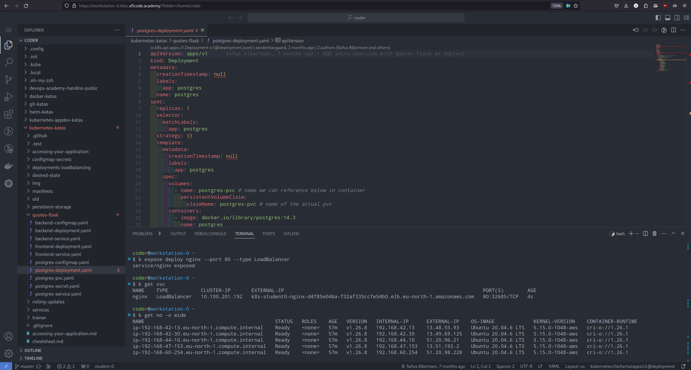
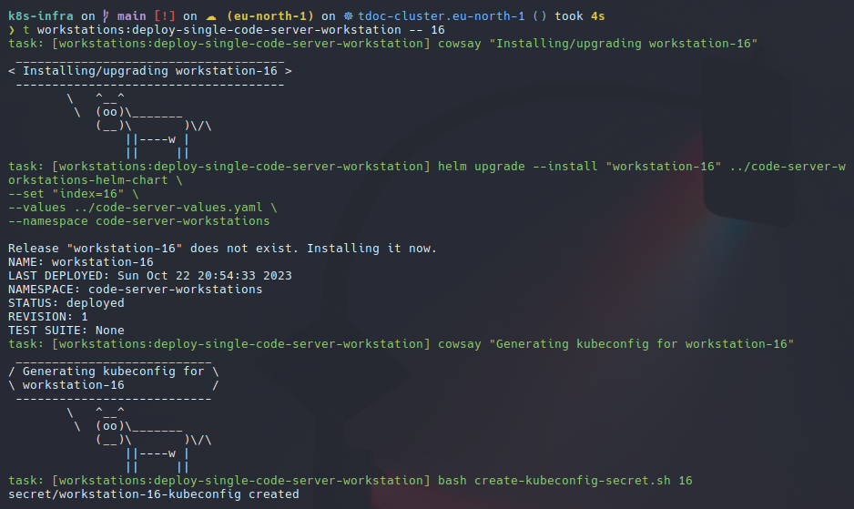

---
# config for slides
theme: dracula
transition: slide-left
fonts:
  sans: "Ubuntu"
  serif: "Ubuntu"
  mono: "Hack"
title: Building a Scalable Cloud Native Training Platform with Kubernetes
author: Zander Havgaard

# layout for first slide
layout: intro
---

# Building a Scalable Cloud Native Training Platform with Kubernetes

TDOC 2023 - Zander Havgaard

---

# $ whoami

## Zander Havgaard

- Senior Software Developer @ **Green.ai** before that **Eficode**
  - This presentations covers the last project I did with Eficode before moving on to new adventures
- Interests: `DevOps`, `Cloud Native`, `Containers`, `Orchestration`, `IaC`, `CI/CD` and more
- I have taught courses in: `Kubernetes`, `Docker`, `Helm`, `Istio`, `Git` and more
- Speaker at meetups

Email: contact@pzh.dk | zanderhavgaard@green.ai

GitHub: `@zanderhavgaard`

---

# Agenda

- The **rationale** behind the design and architecture of our new infrastructure.

- The **open-source technologies** that power our platform, including EKS, eksctl, sysbox, cri-o, task, helm, karpenter, external-dns, lb-controller, cowsay, and more.

- The **rapid MVP development** of our platform in just two weeks, enabled by cloud-native technologies and AI tools.

- How we **tested it in production**: delivering a DevOps summer course at the University of Southern Denmark (SDU) to nearly 100 students.

- A **discussion on the scaling bottleneck** we encountered and the strategies used to overcome it.

#### Format: Slides and live demonstrations of the platform

> Feel free to ask questions and discuss after the talk !

> These slides are on github: https://github.com/zanderhavgaard/talk-building-a-scalable-cloud-native-training-platform

<!-- The **rationale** behind the design and architecture of our new infrastructure. -->

---

# The context

Eficode provides a number of trainings to it's customers in topics such as `kubernetes`, `docker`, `git`, `helm` and many more

Each training consists of a trainer presenting the material as well as a number of hands-on exercises, which we call the **katas**

> All of the katas live on Github and are open source! e.g. https://github.com/eficode-academy/kubernetes-katas

Students thus need an environment in which they can do the exercises without having to set up their own machines

---

# The "old" Infrastructure

To solve the problem of provisioning infrastructure for each training session we created an infrastructure that could be deployed with `terraform`

The project would deploy a number of `ec2` instances to `AWS` and an optional `EKS` cluster.
Each `ec2` instance runs `code-server` to provide a workstation.

This was a great solution for a long time. But over time we outgrew the infrastructure:

- It was hard to maintain --> monolithic architecture with many moving parts --> changes / updates were cumbersome and time-consuming
- It was difficult to extend with new courses
- Too few people had the knowledge to work on it --> _low busfactor_
- Once an infrastructure had been deployed changes could not be made to it in-place, forcing a redeployment --> which would easily take ~30 minutes 

<br>

#### ... So it was time to invest in a new infrastructure

---

# Requirements for the New Infrastructure

> A generic platform for running (cloud native) courses:

- Must work with all existing katas
- The trainer deploying the infrastructure should only have to read a readme to be able to deploy it
- Must deploy successfully every time
- Should be **simple** to maintain
- Everything should be declarative --> avoid running scripts to configure things
- Should be able to run in a pipeline --> for testing and automation

---

# New infrastructure: `k8s-infra`

The infrastructure that I developed to meet these requirements centers around `Kubernetes`

Kubernetes allows us to declare **everything** that we want Kubernetes to control, both _inside_ and _outside_ of the cluster.

-

The idea is to deploy a `Kubernetes cluster` to the `cloud` using the simplest tooling possible.

When we have our cluster, we use the Kubernetes `control-plane` to automate the provisioning and configuration of the infrastructure, in a completely declarative way.

---

# Architecture

TODO


---

# Workstation components

TODO


---

# Demo: Workstation, kubectl, docker



---

<!-- - The **open-source technologies** that power our platform, including EKS, eksctl, sysbox, cri-o, task, helm, karpenter, external-dns, lb-controller, cowsay, and more. -->

# An overview of the technology that powers the platform

In the cloud native ecosystem we tend to have a tool for every problem.
Here are the (important) ones that make up this platform within the categories of:

- `Provisioning`
- `Controllers`
- `Nested Containers`
- `Remote Workstation`
- `Scaling to zero`

---
layout: two-cols
---

# Provisioning

We use `EKS` on AWS to get us a Kubernetes cluster

We deploy the cluster using `eksctl`

We orchestrate the running of `eksctl` and giving our declarative specification to Kubernetes using `task`

Configuration is handled in `vars.env`

- 

After we have deployed the `EKS` cluster we let Kubernetes do the rest of the actual provisioning using a number of controllers!

Trainer simply runs `$ task deploy` to deploy and `$ task destroy` to destroy the infrastructure after the training.

::right::

##### Taskfile.yaml

```yaml
version: "3"
# load env vars from file
dotenv:
  - "vars.env"
# load extra taskfiles
includes:
  eks: "./Taskfile.eks.yaml"
  helm: "./Taskfile.helm.yaml"
  workstations: "./Taskfile.workstations.yaml"
  ...
tasks:
  ...
  deploy:
    cmds:
      - task: eks:create-eks-cluster
      - task: eks:create-eks-public-access-sgr
      - task: eks:install-metrics-server
      - task: dns:create-route-53-records
      - task: dns:request-tls-cert
      - task: deploy-cluster-wide-resources
      - task: helm:install-sysbox
      - task: helm:install-aws-lb-controller
      ...
```

---

# Controllers

We install a number of controllers into the cluster to automate the provisioning of dependent resources: `dns`, `load balancing`, `persistent storage`, `auto scaling` and more. 

We use: `aws-load-balancer-controller`, `external-dns`, `ebs-csi-driver`, `karpenter` to automate these needs!


> The deployed infrastructure is not static and can be scaled up and down after deployment!


##### workstation-ingress.yaml

```yaml
apiVersion: networking.k8s.io/v1
kind: Ingress
metadata:
  annotations:
    kubernetes.io/ingress.class: alb
    alb.ingress.kubernetes.io/scheme: internet-facing
    alb.ingress.kubernetes.io/listen-ports: '[{"HTTPS":443}]'
    alb.ingress.kubernetes.io/certificate-arn: {{ .Values.ingress.certArn }}
    alb.ingress.kubernetes.io/group.name: "code-server-workstations-{{ $lbidx }}"
    alb.ingress.kubernetes.io/healthcheck-path: "/healthz"
    external-dns.alpha.kubernetes.io/hostname: "{{ .Release.Name }}.{{ .Values.ingress.subdomain }}.{{ .Values.ingress.topLevelDomain }}"
  name: code-server-{{ .Release.Name }}
  namespace: {{ .Release.Namespace }}
spec:
  rules:
    - host: "{{ .Release.Name }}.{{ .Values.ingress.subdomain }}.{{ .Values.ingress.topLevelDomain }}"
      http:
        paths:
          - pathType: Prefix
            path: "/"
            backend:
              service:
                name: code-server-{{ .Release.Name }}
                port:
                  number: 4711

```

---
layout: two-cols
---

# Nested Containers

Each workstation is running in a container in a pod

We need to able to use this infrastructure for docker training, so we need to be able to run nested docker containers within each workstation container


Running nested containers has a lot of implications and considerations for `security`, `dependencies` and `functionlity`. 
Most of these have to do with running _containers as root with privileges_.

The most elegant solution (and the one recommended by the people behind code-server) is using `sysbox` which allows us to run nested containers using a native docker daemon in the container. 
`sysbox` uses `cri-o` under-the-hood to enable the functionality.

::right:: 

##### workstation-deployment.yaml

```yaml
apiVersion: apps/v1
kind: Deployment
metadata:
  name: "code-server-{{ .Release.Name }}"
  namespace: {{ .Release.Namespace }}
spec:
  ...
  template:
    metadata:
      annotations:
        "io.kubernetes.cri-o.userns-mode": "auto:size=65536" # needed for cri-o
    spec:
      runtimeClassName: "sysbox-runc" # use sysbox runtime to allow nested docker daemons
      containers:
        - name: code-server
          ...
          command: ["/bin/sh", "-c"]
          args:
            - |
              # root setup script, starts docker daemon
              sudo bash /entrypoint.d/root-setup.sh
              # non-root setup
              bash /home/coder/.init/setup.sh
        ...
```

---
layout: two-cols
---

# Remote Workstations

Each participant needs a workstation where they can do the exercises of training. 
The workstations must also have all of the necessary tools installed and configured.

`Containers` solve this problem, especially together with `Kubernetes`. 

In each container we run `code-server` (https://github.com/codercom/code-server) which provides a graphical workstation that can be served using HTTP

Each workstation is deployed using a `helm chart` and all of the configuration is injected at runtime, for example each students `kubeconfig` as a Kubernetes `secret`.

::right::

##### deploy-workstations.sh

```bash
#!/usr/bin/env bash
# This script will deploy the code-server helm chart a
# specified number of times, depending on the desired count of workstations.

for ((idx = 0; idx < $CODE_SERVER_WORKSTATIONS_COUNT; idx++)); do
    RELEASE_NAME="workstation-${idx}"
    cowsay "Deploying workstation-${idx}"
    
    helm upgrade --install "${RELEASE_NAME}" ../code-server-workstations-helm-chart \
        --set "index=${idx}" \
        --values ../code-server-values.yaml \
        --namespace code-server-workstations

    ...

    cowsay "Deploying kubeconfig for workstation-${idx}"
    bash create-kubeconfig-secret.sh "${idx}"

    ...

    echo "sleep 10 seconds to let aws lb controller deploy ingress resources"
    sleep 10

    ...
done
```

---
layout: two-cols
---

# Scaling to Zero

Since the training infrastructure is only needed during the training itself, but might run over multiple days, it is useful to able to scale the infrastructure to _zero_ when not in use to save money.

This is done in the infrastructure by deploying to `AWS lambdas` which at a specified time will scale the EKS cluster `nodegroup` to 0 nodes, and then back up to the desired count again.

Since each workstation saves it's state to a `pvc` (persistent disk) we can safely _"undeploy"_ the entire workstation infrastructure (save from the Kubernetes control-plane itself) and then simply scale it back up again.

All pods will remain in a `pending` state until nodes are available again.

::right::

##### lambda-handler.py

```python
...
def scale_cluster(auto_scaling_group_name: str, desired_node_count: int) -> bool:
    """Set the autoscaling group to the desired number of nodes, use to scale the cluster up and down"""

    print(f"Scaling the autoscaling group {auto_scaling_group_name} to {desired_node_count} ...")

    # modify the min, max and desired instance counts
    response = AUTOSCALING_CLIENT.update_auto_scaling_group(
        AutoScalingGroupName=auto_scaling_group_name,
        MinSize=desired_node_count,
        MaxSize=desired_node_count,
        DesiredCapacity=desired_node_count,
    )

    if response:
        if DEBUG:
            print("response for update_auto_scaling_group request:")
            pprint(response)
        if response["ResponseMetadata"]["HTTPStatusCode"] == 200:
            print(f"Successfully scaled ASG: {auto_scaling_group_name} to {desired_node_count} nodes.")
            return True
    return False
...
```

---

# Demo: Deploying Workstation to an Existing Cluster



---

<!-- - The **rapid MVP development** of our platform in just two weeks, enabled by cloud-native technologies and AI tools. -->

# Cloud Native Technology Enables Rapid Development

The new infrastructure was developed by one person (me) in _roughly two weeks of "work time"_

This was possible by utilizing __Cloud Native__ technology and the ways of working that they enable

Since I, for the most part, can _declare_ everything that I want, and don't have to worry about _how_ to actually do it --> Kubernetes does the heavy lifting for me!

I also heavily relied on projects that have _sane defaults_ so that I can follow best practices _by only configuring exactly what I need_

(of course I have a lot of knowledge of the ecosystem and had discussed the idea/design with colleagues beforehand) but the actual implementation was shockingly doable for a single person over a short period of time.

The __takeaway__ I want you to have is that: 

> if you buy in to the Cloud Native ecosystem it enables a lot of functionality with a relatively low barrier to entry (once you are in)

---

# Bonus: Using AI Tools to Speed up Development

AI development tools are all the rage these days ...

... But I did use them to develop this project, specifically `Chat-GPT` with `GPT 4.0`

Which is really good for very generic code such as _"take this terraform code and translate it into a bash script that creates the same resources in AWS"_ which allowed me to do speed things up further by not having to dig through documentation to figure out how to do things (that I knew I could do, just not how) with the `AWS CLI`.

> Takeaway: If you are not using AI tools to help your development you are missing out, and you will eventually be left behind by people who are. 

---

<!-- - How we **tested it in production**: delivering a DevOps summer course at the University of Southern Denmark (SDU) to nearly 100 students. -->

# How we Tested the Infrastructure in Production

After the initial MVP of the platform was ready we immediately went on to test it at a summer course we were teaching at the __University of Southern Denmark__ for __almost 100 students__!


---

the platform was tested in "production" this year at a summer course at SDU

~80 students over two weeks

ran 90 workstations on 9 ec2 machines!

For the most part the experience was seamless and smooth, and the performance was good!

some rare weird issues with docker - probably caused by sysbox

automation to turn off the clusters at night when not in use

was significantly cheaper to run than the old setup

---

<!-- - A **discussion on the scaling bottleneck** we encountered and the strategies used to overcome it. -->

the platform does have a scaling bottleneck - the aws-lb-controller and the number of ingresses that we are creating

we are abusing the ingress functionality / controller for things it was intended for

the ingress controller can handle about 3 lbs with 30 machines sharded across them

the solution at the summer course was to deploy 3 identical clusters

this could potentially be solved by abanonding the need for arbitrary open ports on pods

or by deploying the lb controller in namespaced mode

maybe a service mesh could help?

---

next steps:

argocd-katas being developed to run on top of the platform

---

Thank you!

```

```
